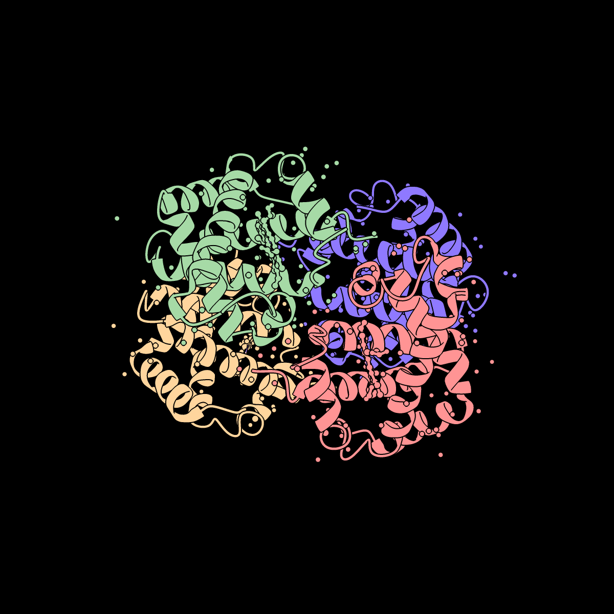
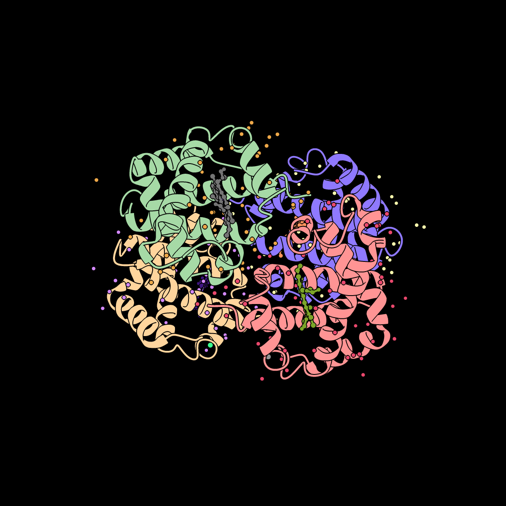
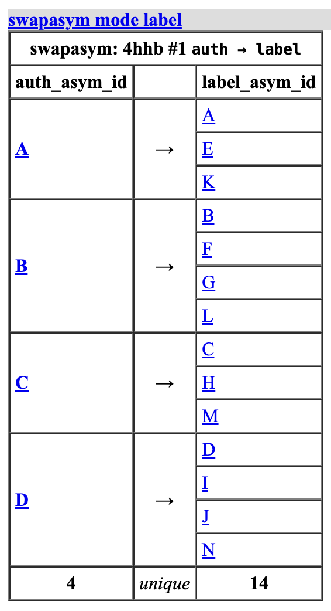
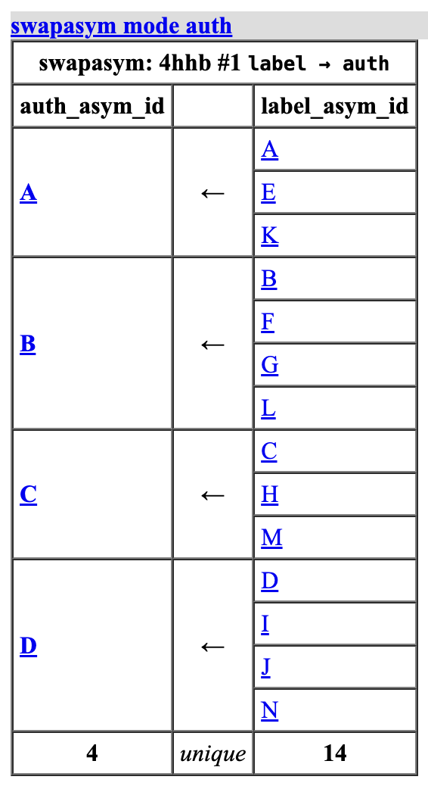

# ChimeraX-SwapAsym

Swap `chain_id` between `auth_asym_id` (PDB) and `label_asym_id` (mmCIF) on
loaded atomic structures.

## Motivation

mmCIF files carry two chain identifiers:

- `auth_asym_id` — the author / PDB chain ID (what ChimeraX exposes as
  `Residue.chain_id` and uses everywhere in the UI).
- `label_asym_id` — the mmCIF identifier, where each polymer / branched
  entity / ligand / waters group typically gets its own ID (read-only
  `Residue.mmcif_chain_id`).

This bundle copies both into custom Residue attributes on first use so you
can switch the primary `chain_id` between the two sides, or select residues
by either ID from an atom-spec.

## Command

```
swapasym [structures]  [mode  auto|label|auth]  [color  true|false]
```

| Option | Meaning |
|---|---|
| `structures` | Atom-spec of structures to operate on. Defaults to all open atomic models. |
| `mode auto` | Toggle: auth → label on first run, label → auth on next run (default). Raises when the structure is in a mixed state. |
| `mode label` | Force `chain_id := label_asym_id`. |
| `mode auth` | Force `chain_id := auth_asym_id` (original PDB chain). |
| `color true` | After the swap, run `color bychain` on each affected structure — useful for immediately visualizing the chain split on the label side. Default `false`. |

The bundle registers two custom Residue attributes usable from atom-specs:

```
select ::auth_asym_id="A"
select ::label_asym_id="E"
```

Attribute values are populated automatically on every mmCIF structure
the moment it opens (and on any structures already loaded when the
bundle initializes), so the selectors work before you ever run
`swapasym`. Non-mmCIF structures (plain `.pdb`) are silently skipped;
`swapasym` will still raise a UserError if you invoke it explicitly on
one of them.

> **Note — 4-character `mmcif_chain_id` cap.** `label_asym_id` is read
> via `Residue.mmcif_chain_id`, which ChimeraX truncates to 4 characters.
> All current wwPDB deposits fit within that cap, so the auto-populated
> value normally matches `_atom_site.label_asym_id` exactly. If you load
> a custom mmCIF with longer `_atom_site.label_asym_id` values, distinct
> ids may collide after truncation and `swapasym mode label` will merge
> those chains.

## Example

```
open 4hhb
info chains              # 4 polymer chains: A B C D (auth)
swapasym color true      # 14 unique chain_ids + auto color bychain:
                         #     A-D polymer, E-J HEM/PO4, K-N waters
select /E,F,G,H,I,J      # select all HEM / PO4 via standard atom-spec
swapasym color true      # back to 4 chains A B C D, re-colored
```

Coloring 4HHB with `color bychain` makes the effect of `swapasym` obvious.
Before swap, every HEM / PO4 / water residue inherits the color of its
host author chain (4 colors total). After swap, the ligands and waters
carry their mmCIF `label_asym_id` values, so each gets its own color.

| Before `swapasym` (auth, 4 chains) | After `swapasym` (label, 14 chains) |
|:---:|:---:|
|  |  |

Each `swapasym` run writes an HTML report to the ChimeraX log: the
direction arrow flips with the swap, the groupby table shows which
label chains every auth chain redistributes into, and every chain id
is a clickable selector.

| `swapasym mode label` | `swapasym mode auth` |
|:---:|:---:|
|  |  |

Structures that were not loaded from mmCIF (plain `.pdb` files) have no
`mmcif_chain_id` information, so `swapasym` raises a UserError when you
try to use it. Reload the structure from a `.cif` file to proceed.

## Installation

### From source (ChimeraX command line)

Clone the repository, then from the ChimeraX command line (the input
field at the bottom of the ChimeraX GUI) run:

```
devel install /path/to/ChimeraX-SwapAsym
```

`devel install` builds the wheel if necessary and installs the bundle
into the running ChimeraX profile. See `help devel` inside ChimeraX for
the full command reference.

### From a pre-built wheel (ChimeraX command line)

```
toolshed install /path/to/ChimeraX_SwapAsym-0.2.0-py3-none-any.whl
```

### From the shell (headless)

Run the same ChimeraX commands without launching the GUI:

```bash
ChimeraX --nogui --exit --cmd 'devel install . exit true'
```

The leading `--exit` guarantees ChimeraX quits even if the install
fails; the trailing `exit true` quits immediately on success. On macOS
the launcher lives at
`/Applications/ChimeraX-<version>.app/Contents/bin/ChimeraX`.

### Using echidna (optional helper)

[echidna](https://github.com/N283T/echidna) (`echi`) wraps the same
commands for faster iteration during development:

```bash
echi build      # build wheel (wraps `devel build`)
echi install    # install to ChimeraX (wraps `devel install`)
echi run --script scripts/smoke.cxc
```

## Development

Run the pytest suite (no ChimeraX runtime required; `chimerax.*`
imports are stubbed in `tests/conftest.py`):

```bash
uv run --no-project --with pytest pytest tests/
```

### Tests

Pytest suite uses stubbed ChimeraX imports and can run under any Python
≥3.11 without a ChimeraX installation:

```bash
uv run --with pytest pytest
```

## License

MIT
